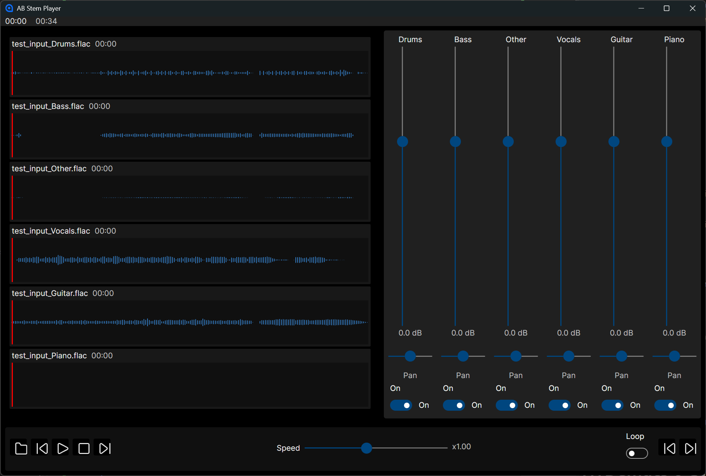

# ABStemPlayer

ABStemPlayer is a Avalonia 12 audio player application built with .NET, designed for 
real‑time media processing, modern UI rendering, and cross‑platform deployment. 
The project focuses on predictable performance, clean architecture, and production‑grade 
engineering practices.



## Features

- Stem splitting and mixing 
  - Drums
  - Bass
  - Other
  - Vocals
  - Guitar
  - Piano
- Turn each stem on and off independently
- Pan stems left or right
- Audio player with A/B looping and speed control

**Techy stuff:**

- .NET 10
- Cross‑platform UI built with Avalonia 12
- ONNX Runtime integration for ML inference
- htdemucs_6s.onnx for stem splitting 

> YOU HAVE TO DOWNLOAD htdemucs_6s.onnx YOURSELF DUE TO GITHUB SIZE LIMITATIONS
> https://huggingface.co/StemSplitio/htdemucs-6s-onnx/blob/main/htdemucs_6s.onnx

## Requirements

- .NET 10 or later
- Avalonia 12
- ONNX Runtime (CPU or GPU)
- FFmpeg

# HTDemucs 6‑Stem ONNX Model Guide

## Overview

**HTDemucs‑6s** is a state‑of‑the‑art music source separation model capable of splitting a stereo mix into **six distinct stems**:

- Drums  
- Bass  
- Vocals  
- Guitar  
- Piano  
- Other  

The model is designed for **high‑fidelity separation**, **low artifacts**, and **robust performance** on modern CPU inference engines.

---

## Required Model File

```
File Name: htdemucs_6s.onnx
Placement: Place the model inside your application's data directory: /Data/htdemucs_6s.onnx
```

### Why this model
This ONNX export is specifically built for:

- **CPU inference**
- **float32 audio processing**
- **6‑stem output**
- **44.1 kHz stereo input**

Using any other Demucs variant (4‑stem, hybrid, GPU‑optimized, etc.) will result in incompatible tensor shapes.

---

## Model Input Specification

### Input Tensor Name
```
mix
```

### Input Shape
```
[1, 2, N]
```

Where:

- `1` = batch size  
- `2` = stereo channels  
- `N` = number of audio samples in the segment  

### Audio Requirements

- **Sample rate:** 44,100 Hz  
- **Channels:** Stereo  
- **Format:** float32 PCM  
- **Normalization:** Standard waveform scaling  

---

## Model Output Specification

### Output Tensor Name
```
stems
```

### Output Shape
```
[1, 6, 2, N]
```

Where:

- `1` = batch  
- `6` = stems  
- `2` = stereo  
- `N` = same segment length as input  

Each stem is returned as a stereo float32 waveform.

---

## Technical Details

HTDemucs‑6s is based on the **Hybrid Demucs architecture**, combining:

- Convolutional encoder/decoder  
- Multi‑band processing  
- Transformer blocks for long‑range context  
- Overlap‑add reconstruction  
- Six‑head output layer  

This design allows the model to preserve transients, maintain stereo imaging, and reduce musical bleed between stems.

### Supported ONNX Operations

The model uses only standard ONNX ops, including:

- Conv / ConvTranspose  
- LayerNorm / GroupNorm  
- Multi‑Head Attention  
- GELU / ReLU  
- Reshape / Transpose  
- Basic arithmetic ops  

This ensures full compatibility with CPU execution providers.

---

## Downloading the Correct Model

Make sure you download the **HTDemucs 6‑stem ONNX export**, not:

- 4‑stem Demucs  
- Hybrid Demucs v3/v4 PyTorch checkpoints  
- GPU‑optimized ONNX models  
- Models with different sample rates  

If you need a verified download link, choose:  
- **https://huggingface.co/StemSplitio/htdemucs-6s-onnx/blob/main/htdemucs_6s.onnx**

---

## Verification

To ensure you have the correct model, check:

| Property | Expected |
|---------|----------|
| File name | `htdemucs_6s.onnx` |
| Input tensor | `mix` |
| Input shape | `[1, 2, N]` |
| Output tensor | `stems` |
| Output shape | `[1, 6, 2, N]` |
| Sample rate | 44.1 kHz |
| Channels | Stereo |
| Stems | 6 |
| Execution | CPU |

SHA256: `48F8E84945579F8AB340E083339E9221E03785DBE733A52C388200B6D3CA779A`

---

# Copyright notices

## Icons

```
COLLECTION: Gentlecons Interface Icons
LICENSE: CC Attribution License
AUTHOR: Konstantin Filatov
```